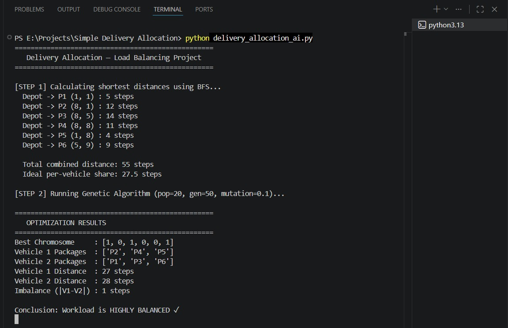
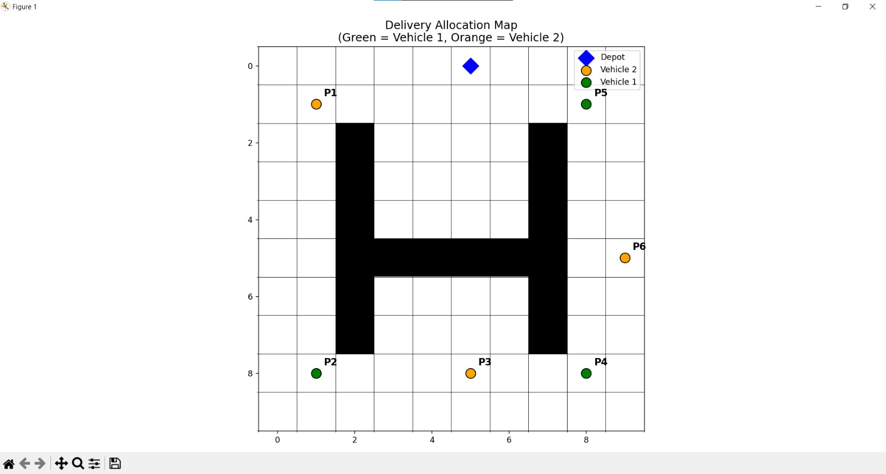

# Simple Delivery Allocation (Load Balancing)

A Python project that compares BFS pathfinding with a genetic algorithm to balance delivery workloads across two vehicles on a grid with obstacles. The system computes shortest path costs to each delivery point, then uses a GA to distribute packages so the total distance per vehicle is as equal as possible.

## Features
- 10x10 grid with obstacles (non-trivial environment)
- BFS shortest-path distance from depot to each delivery point
- Genetic algorithm for load-balanced package allocation
- Clear fitness function: minimizes distance imbalance
- Early stopping based on target fitness or no-improvement patience
- Matplotlib visualization of depot, obstacles, and assignments

## Tech Stack
- Python 3.x
- NumPy
- Matplotlib
- random (standard library)

## How It Works
1. **BFS** calculates the shortest path from the depot to each delivery point.
2. **GA** assigns each package to Vehicle 1 or Vehicle 2 using a 6-bit chromosome.
3. **Fitness** rewards balanced workloads using:

fitness = 1 / (1 + |W1 - W2|)

4. **Visualization** shows the grid, depot, and assigned delivery points.

## Project Structure
- `delivery_allocation_ai.py` - main implementation

## Run the Project
```bash
python delivery_allocation_ai.py
```

## Output
- Prints BFS distances to each delivery point
- Prints best chromosome and vehicle assignments
- Prints total distance per vehicle and imbalance
- Opens a Matplotlib figure showing allocations

## Screenshots



## Notes
- Chromosome: binary array of length 6  
- Crossover: single-point  
- Mutation: random reset (binary gene), 10% per gene  
- Selection: tournament (size 3)  
- Termination: max generations, target fitness, or no-improvement patience  
- Goal: minimize distance imbalance between vehicles  

---

## Built With ❤️
Built with ❤️ by Fathy

